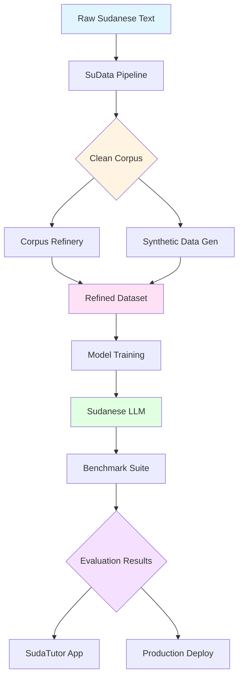

<div align="center">

# 🌌 Sudaverse Ecosystem

### Building Sudanese Dialect into the Heart of AI

[](https://opensource.org/licenses/MIT)
[](https://discord.gg/3nbnQ9Cy)
[](https://github.com/sudaverse/sudaverse/graphs/contributors)
[](https://github.com/sudaverse/sudaverse/stargazers)


**An open-source AI ecosystem dedicated to developing, training, evaluating, and scaling models that understand and generate Sudanese dialect — built for culture, community, and the future.**

[🚀 Quick Start](#-quick-start) • [📚 Documentation](#-ecosystem-components) • [🤝 Contributing](#-contributing) • [💬 Community](#-community)

---

</div>

## 📖 Table of Contents

- [🎯 Vision & Mission](#-vision--mission)
- [✨ Key Features](#-key-features)
- [🏗️ Ecosystem Architecture](#️-ecosystem-architecture)
- [📚 Ecosystem Components](#-ecosystem-components)
- [🚀 Quick Start](#-quick-start)
- [📊 Project Status](#-project-status)
- [🗺️ Roadmap](#️-roadmap)
- [🤝 Contributing](#-contributing)
- [💬 Community](#-community)
- [📄 License](#-license)

---

## 🎯 Vision & Mission

<table>
<tr>
<td width="50%">

### 🌟 Vision

A digital future where Sudanese dialect is **fully represented** across AI systems — understood, generated, and respected by modern language technologies.

</td>
<td width="50%">

### 🎯 Mission

To build the world's most comprehensive open-source infrastructure for Sudanese dialect NLP, ensuring linguistic preservation and technological advancement.

</td>
</tr>
</table>

### 🔑 Core Objectives

| Objective | Description |
|-----------|-------------|
| 📦 **Corpus Building** | Develop the largest open-source Sudanese dialect dataset |
| 🧹 **Data Quality** | Normalize and clean dialect data using advanced AI tools |
| 🤖 **Synthetic Generation** | Create high-quality synthetic Sudanese text at scale |
| 🧠 **Model Training** | Train and fine-tune state-of-the-art LLMs for Sudanese dialect |
| 📊 **Benchmarking** | Establish comprehensive evaluation standards for dialect models |
| 👥 **Community** | Foster an active community of developers, linguists, and contributors |

---

## ✨ Key Features

<div align="center">

| 🎯 Feature | 📝 Description |
|:----------:|----------------|
| 🌍 **Dialect-Aware** | Purpose-built for Sudanese dialect orthography, phonology, and syntax |
| 🔓 **Open Source** | Fully transparent, MIT-licensed, community-driven development |
| 🔄 **End-to-End Pipeline** | Complete workflow from raw text to production-ready models |
| 📚 **Educational Focus** | Curriculum-anchored tools like SudaTutor for learning applications |
| 🧪 **Research-Grade** | Rigorous benchmarking and evaluation frameworks |
| 🚀 **Production-Ready** | Docker support, CI/CD pipelines, and deployment guides |

</div>

---

## 🏗️ Ecosystem Architecture



---

## 📚 Ecosystem Components

### 🎓 Production Systems

| Project | Description | Status | Links |
|---------|-------------|--------|-------|
| **🎓 SudaTutor** | Educational platform with 117+ subjects. Bilingual with RAG, citations, source-grounded answers. |  | [📦 Repo](https://github.com/sudaverse/sudatutor) • [📖 Docs](https://github.com/sudaverse/sudatutor#readme) |
| **🧹 SuData** | Data normalization & curation pipeline for Sudanese dialect text. Noise removal, PII filtering. |  | [📦 Repo](https://github.com/sudaverse/SuData) • [📖 Docs](https://github.com/sudaverse/SuData#readme) |
| **🔧 Corpus Refinery** *(LLMCorpusKit)* | Large-scale corpus cleaning with AI-powered semantic repairs, sentence fixing. |  | [📦 Repo](https://github.com/sudaverse/LLMCorpusKit) • [📖 Docs](https://github.com/sudaverse/LLMCorpusKit#readme) |
| **📖 Normalizer** | Sudanese dialect text normalization toolkit. Dialect-aware spelling, punctuation repair. |  | [📦 Repo](https://github.com/sudaverse/sudaverse-normalizer) • [📖 Docs](https://github.com/sudaverse/sudaverse-normalizer#readme) |

### 🔬 Research & Development

| Project | Description | Status |
|---------|-------------|--------|
| **🎲 Synthetic Data Generator** | Regional Sudanese dialect text generator (Khartoum, Darfur, East, South) |  |
| **📊 Dialect Benchmark** | Comprehensive tokenizer & model benchmark for Sudanese dialect |  |
| **📦 Data Hub** | Central registry for Sudanese dialect datasets with metadata |  |

---

## 🚀 Quick Start

### Prerequisites

- Python 3.8+
- Git
- Docker (optional)

### Installation

```bash
# Clone the main ecosystem repository
git clone https://github.com/sudaverse/sudaverse.git
cd sudaverse

# Set up virtual environment
python -m venv venv
source venv/bin/activate  # Windows: venv\Scripts\activate
```

### Component Installation

**📊 SuData Setup:**
```bash
cd sudata
pip install -r requirements.txt
python run.py --input ../data/raw/ --output ../data/clean/
```

**🎓 SudaTutor Setup:**
```bash
git clone https://github.com/sudaverse/sudatutor.git
cd sudatutor
# Follow repository README for full installation
```

---

## 📊 Project Status

<div align="center">

| Component | Status | Version | Last Updated |
|:---------:|:------:|:-------:|:------------:|
| SudaTutor |  | v6.0 | 2025-Q3 |
| SuData |  | v2.1 | 2025-Q3 |
| Corpus Refinery |  | v1.5 | 2025-Q3 |
| Normalizer |  | v1.0 | 2025-Q4 |
| Synthetic Gen |  | - | 2025-Q4 |
| Benchmark |  | - | 2025-Q4 |
| Data Hub |  | - | 2026-Q1 |

</div>

---

## 🗺️ Roadmap

### 2025 Q4 🚧
- [ ] Release Synthetic Data Generator v1.0
- [ ] Launch Sudanese Dialect Benchmark suite
- [ ] Complete SudaTutor Roadmap Project
- [ ] Expand documentation and tutorials

### 2026 Q1 📋
- [ ] Develop Data Hub infrastructure
- [ ] Release first fine-tuned Sudanese dialect LLM
- [ ] Organize virtual community summit
- [ ] Launch contributor recognition program

---

## 🤝 Contributing

We welcome contributions from developers, linguists, researchers, and Sudanese dialect speakers worldwide!

### How to Contribute

**💻 Code:** Bug fixes, features, performance improvements, documentation  
**📝 Data:** Raw dialect text, dialect samples, annotations, quality reviews  
**📚 Research:** Linguistic analysis, benchmark design, evaluation protocols  

### Contribution Workflow

```bash
# 1. Fork the repository
git fork https://github.com/sudaverse/sudaverse.git

# 2. Create a feature branch
git checkout -b feature/your-amazing-feature

# 3. Make changes and commit
git commit -m "feat: add incredible new feature"

# 4. Push and open a Pull Request
git push origin feature/your-amazing-feature
```

---

## 💬 Community

| Platform | Purpose | Link |
|:--------:|---------|------|
| 💬 **Discord** | Real-time chat, collaboration | [Join Discord](https://discord.gg/3nbnQ9Cy) |
| 📧 **Email** | Official communications | [info@sudaverse.com](mailto:info@sudaverse.com) |
| 🌐 **Website** | Documentation, resources | [sudaverse.com](https://www.sudaverse.com) |

### Resources

- 📖 [Documentation](https://docs.sudaverse.com)
- 🎓 [Tutorials & Guides](https://github.com/sudaverse/sudaverse/wiki)
- 🐛 [Issue Tracker](https://github.com/sudaverse/sudatutor/issues)
- 📊 [Project Board](https://github.com/orgs/sudaverse/projects/1)

---

## 📄 License

This project is licensed under the **MIT License** - see the [LICENSE](LICENSE) file for details.

### Citation

```bibtex
@misc{sudaverse2024,
  title={Sudaverse: An Open-Source Ecosystem for Sudanese Dialect NLP},
  author={Sudaverse Contributors},
  year={2024},
  url={https://github.com/sudaverse/sudaverse}
}
```

---

<div align="center">

## 💛 Built for Sudan. Built for Culture. Built for the Future.

**Sudaverse exists to ensure Sudanese dialect — our language, identity, and stories — continue into the AI era.**

[⭐ Star this repo](https://github.com/sudaverse/sudaverse) • [🔔 Watch for updates](https://github.com/sudaverse/sudaverse/subscription) • [🍴 Fork and contribute](https://github.com/sudaverse/sudaverse/fork)

Made with 💛 by the Sudanese AI community

[](https://github.com/sudaverse)

</div>
