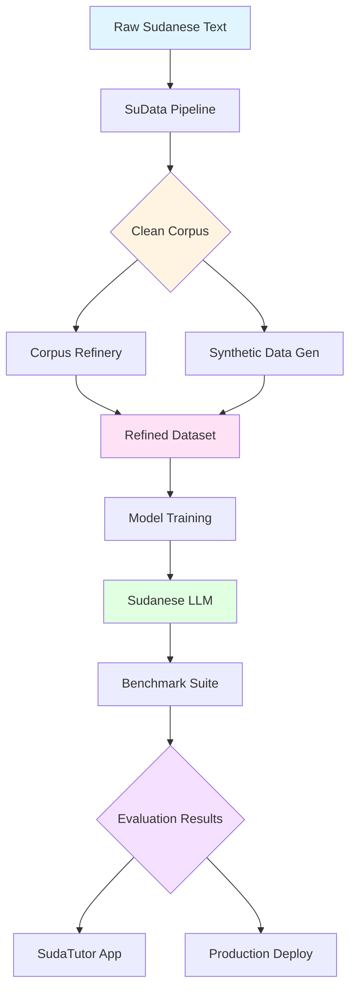

<div align="center">

# 🌌 Sudaverse Ecosystem

### Building Sudanese Arabic into the Heart of AI

[](https://opensource.org/licenses/MIT)
[](https://discord.gg/3nbnQ9Cy)
[](https://github.com/sudaverse/sudaverse/graphs/contributors)
[](https://github.com/sudaverse/sudaverse/stargazers)


**An open-source AI ecosystem dedicated to developing, training, evaluating, and scaling models that understand and generate Sudanese Arabic dialect — built for culture, community, and the future.**

[🚀 Quick Start](#-quick-start) • [📚 Documentation](#-ecosystem-components) • [🤝 Contributing](#-contributing) • [💬 Community](#-community)

---

</div>

## 📖 Table of Contents

- [🎯 Vision & Mission](#-vision--mission)
- [✨ Key Features](#-key-features)
- [🏗️ Ecosystem Architecture](#️-ecosystem-architecture)
- [📚 Ecosystem Components](#-ecosystem-components)
- [🚀 Quick Start](#-quick-start)
- [📊 Project Status](#-project-status)
- [🗺️ Roadmap](#️-roadmap)
- [🤝 Contributing](#-contributing)
- [💬 Community](#-community)
- [📄 License](#-license)

---

## 🎯 Vision & Mission

<table>
<tr>
<td width="50%">

### 🌟 Vision

A digital future where Sudanese Arabic is **fully represented** across AI systems — understood, generated, and respected by modern language technologies.

</td>
<td width="50%">

### 🎯 Mission

To build the world's most comprehensive open-source infrastructure for Sudanese Arabic NLP, ensuring linguistic preservation and technological advancement.

</td>
</tr>
</table>

### 🔑 Core Objectives

| Objective | Description |
|-----------|-------------|
| 📦 **Corpus Building** | Develop the largest open-source Sudanese Arabic dataset |
| 🧹 **Data Quality** | Normalize and clean dialect data using advanced AI tools |
| 🤖 **Synthetic Generation** | Create high-quality synthetic Sudanese text at scale |
| 🧠 **Model Training** | Train and fine-tune state-of-the-art LLMs for Sudanese Arabic |
| 📊 **Benchmarking** | Establish comprehensive evaluation standards for dialect models |
| 👥 **Community** | Foster an active community of developers, linguists, and contributors |

---

## ✨ Key Features

<div align="center">

| 🎯 Feature | 📝 Description |
|:----------:|----------------|
| 🌍 **Dialect-Aware** | Purpose-built for Sudanese Arabic orthography, phonology, and syntax |
| 🔓 **Open Source** | Fully transparent, MIT-licensed, community-driven development |
| 🔄 **End-to-End Pipeline** | Complete workflow from raw text to production-ready models |
| 📚 **Educational Focus** | Curriculum-anchored tools like SudaTutor for learning applications |
| 🧪 **Research-Grade** | Rigorous benchmarking and evaluation frameworks |
| 🚀 **Production-Ready** | Docker support, CI/CD pipelines, and deployment guides |

</div>

---

## 🏗️ Ecosystem Architecture



### 📊 Data Flow

```
┌─────────────────────────────────────────────────────────────────┐
│                     RAW DATA SOURCES                            │
│  Social Media • Chat Logs • Transcripts • Web Scraping          │
└────────────────────────┬────────────────────────────────────────┘
                         │
                         ▼
┌─────────────────────────────────────────────────────────────────┐
│                        🧹 SuData                                │
│  Noise Removal • Normalization • PII Filtering • Deduplication  │
└────────────────────────┬────────────────────────────────────────┘
                         │
                         ▼
┌─────────────────────────────────────────────────────────────────┐
│                   🔧 Corpus Refinery                            │
│  Punctuation • Spacing • Structure Repair • Semantic Cleaning   │
└─────────────┬──────────────────────────┬────────────────────────┘
              │                          │
              ▼                          ▼
┌──────────────────────┐    ┌────────────────────────────────────┐
│  🎲 Synthetic Data   │    │      📦 Clean Corpus              │
│     Generator        │    │   Ready for Training              │
└──────────┬───────────┘    └─────────────┬──────────────────────┘
           │                              │
           └──────────────┬───────────────┘
                          ▼
              ┌───────────────────────┐
              │   📊 Benchmark Suite  │
              │  Tokenizer Evaluation │
              └───────────────────────┘
```

---

## 📚 Ecosystem Components

### 🎓 Production Systems

<table>
<tr>
<th width="25%">Project</th>
<th width="40%">Description</th>
<th width="20%">Status</th>
<th width="15%">Links</th>
</tr>

<tr>
<td><strong>🎓 SudaTutor</strong></td>
<td>
Curriculum-anchored educational RAG system covering 117+ subjects across Sudanese primary & secondary education tracks.
<br><br>
<strong>Features:</strong>
<ul>
<li>Bilingual (Arabic & English)</li>
<li>Source-grounded answers with citations</li>
<li>Docker & Vite deployment</li>
<li>Production-ready pilot</li>
</ul>
</td>
<td></td>
<td>
<a href="https://github.com/O96a/sudatutor-v6">📦 Repo</a><br>
<a href="https://github.com/O96a/sudatutor-v6#readme">📖 Docs</a>
</td>
</tr>

<tr>
<td><strong>🧹 SuData</strong></td>
<td>
End-to-end data normalization & curation pipeline for Sudanese Arabic text processing.
<br><br>
<strong>Features:</strong>
<ul>
<li>Robust cleaning (noise, emojis, HTML)</li>
<li>Dialect-aware spelling normalization</li>
<li>PII removal & deduplication</li>
<li>Multiple export formats (JSON/JSONL/CSV)</li>
</ul>
</td>
<td></td>
<td>
<a href="https://github.com/O96a/SuData">📦 Repo</a><br>
<a href="https://github.com/O96a/SuData#readme">📖 Docs</a>
</td>
</tr>

<tr>
<td><strong>🔧 Corpus Refinery</strong><br><em>(LLMCorpusKit)</em></td>
<td>
Large-scale Arabic corpus cleaning & polishing toolkit with AI-powered semantic repairs.
<br><br>
<strong>Features:</strong>
<ul>
<li>Deep-cleaning workflows</li>
<li>Sentence repair & structure fixing</li>
<li>API integration (Gemini & others)</li>
<li>Bulk & streaming processors</li>
</ul>
</td>
<td></td>
<td>
<a href="https://github.com/O96a/LLMCorpusKit">📦 Repo</a><br>
<a href="https://github.com/O96a/LLMCorpusKit#readme">📖 Docs</a>
</td>
</tr>

</table>

### 🔬 Research & Development

<table>
<tr>
<th width="25%">Project</th>
<th width="40%">Description</th>
<th width="20%">Status</th>
<th width="15%">Links</th>
</tr>

<tr>
<td><strong>🎲 Synthetic Data<br>Generator</strong></td>
<td>
High-quality Sudanese dialect synthetic text generator with regional awareness.
<br><br>
<strong>Features:</strong>
<ul>
<li>Region-aware dialects (Khartoum, Darfur, East, South)</li>
<li>Multiple formats (dialogue, scenarios, instructions)</li>
<li>Style & sentiment controls</li>
<li>Scalable generation pipeline</li>
</ul>
</td>
<td></td>
<td>
<a href="#">🔜 Coming Soon</a>
</td>
</tr>

<tr>
<td><strong>📊 Sudanese Dialect<br>Benchmark</strong></td>
<td>
Comprehensive tokenizer & model benchmark suite tailored to Sudanese Arabic.
<br><br>
<strong>Features:</strong>
<ul>
<li>Tokenization accuracy metrics</li>
<li>Coverage tests for slang & variants</li>
<li>Multi-tokenizer comparison</li>
<li>Dialect fitness scoring</li>
</ul>
</td>
<td></td>
<td>
<a href="#">🔜 Coming Soon</a>
</td>
</tr>

<tr>
<td><strong>📦 Data Hub</strong></td>
<td>
Central registry & metadata catalog for all Sudanese Arabic datasets.
<br><br>
<strong>Planned Features:</strong>
<ul>
<li>Dataset manifests & licensing</li>
<li>Contributor credits & versioning</li>
<li>Sample previews</li>
<li>Download & API access</li>
</ul>
</td>
<td></td>
<td>
<a href="#">📋 Roadmap</a>
</td>
</tr>

</table>

---

## 🚀 Quick Start

### Prerequisites

- Python 3.8+
- Git
- Docker (optional, for containerized deployment)

### Installation

```bash
# Clone the main ecosystem repository
git clone https://github.com/sudaverse/sudaverse.git
cd sudaverse

# Set up virtual environment
python -m venv venv
source venv/bin/activate  # On Windows: venv\Scripts\activate
```

### Component Installation

<details>
<summary><strong>📊 SuData Setup</strong></summary>

```bash
# Navigate to SuData
cd sudata

# Install dependencies
pip install -r requirements.txt

# Run normalization pipeline
python run.py --input ../data/raw/ --output ../data/clean/
```

</details>

<details>
<summary><strong>🔧 Corpus Refinery Setup</strong></summary>

```bash
# Navigate to Corpus Refinery
cd llmcorpuskit

# Install dependencies
pip install -r requirements.txt

# Run refining process
python refine.py --input ../data/clean/ --output ../data/refined/
```

</details>

<details>
<summary><strong>🎓 SudaTutor Setup</strong></summary>

```bash
# Clone SudaTutor
git clone https://github.com/O96a/sudatutor-v6.git
cd sudatutor-v6

# Follow installation guide in repository
# See: https://github.com/O96a/sudatutor-v6#installation
```

</details>

### Basic Workflow

```bash
# 1. Normalize raw data
python sudata/run.py --input raw/ --output clean/

# 2. Refine corpus (optional)
python corpus_refinery/refine.py --input clean/ --output refined/

# 3. Generate synthetic data (when available)
python synthetic_gen/generate.py --samples 50000

# 4. Train models
python train.py --config configs/base.yaml

# 5. Run benchmarks
python benchmark/run.py --model outputs/model/
```

---

## 📊 Project Status

<div align="center">

| Component | Status | Version | Last Updated |
|:---------:|:------:|:-------:|:------------:|
| SudaTutor |  | v6.0 | 2025-Q3 |
| SuData |  | v2.1 | 2025-Q3 |
| Corpus Refinery |  | v1.5 | 2025-Q3 |
| Synthetic Gen |  | - | 2025-Q4 |
| Benchmark |  | - | 2025-Q4 |
| Data Hub |  | - | 2026-Q1 |

</div>

---

## 🗺️ Roadmap

### 2025 Q3 ✅

- [x] Launch SudaTutor pilot program
- [x] Release SuData v2.0 with enhanced normalization
- [x] Stabilize Corpus Refinery toolkit
- [x] Establish community Discord server

### 2025 Q4 🚧

- [ ] Release Synthetic Data Generator v1.0
- [ ] Launch Sudanese Dialect Benchmark suite
- [ ] Publish baseline evaluation results
- [ ] Expand documentation and tutorials

### 2026 Q1 📋

- [ ] Develop Data Hub infrastructure
- [ ] Release first fine-tuned Sudanese LLM
- [ ] Organize virtual community summit
- [ ] Launch contributor recognition program

### 2026 Q2+ 🔮

- [ ] Multi-dialect model support
- [ ] Real-time inference API
- [ ] Mobile application integrations
- [ ] Academic partnerships and publications

---

## 🤝 Contributing

We welcome contributions from developers, linguists, researchers, and Sudanese Arabic speakers worldwide!

### How to Contribute

<table>
<tr>
<td width="33%" align="center">

### 💻 Code

Submit PRs for:
- Bug fixes
- New features
- Performance improvements
- Documentation

</td>
<td width="33%" align="center">

### 📝 Data

Contribute:
- Raw Sudanese text
- Dialect samples
- Annotations
- Quality reviews

</td>
<td width="33%" align="center">

### 📚 Research

Help with:
- Linguistic analysis
- Benchmark design
- Evaluation protocols
- Academic papers

</td>
</tr>
</table>

### Contribution Workflow

1. **Fork** the repository
   ```bash
   git fork https://github.com/sudaverse/sudaverse.git
   ```

2. **Create** a feature branch
   ```bash
   git checkout -b feature/your-amazing-feature
   ```

3. **Commit** your changes
   ```bash
   git commit -m "feat: add incredible new feature"
   ```

4. **Push** to your fork
   ```bash
   git push origin feature/your-amazing-feature
   ```

5. **Open** a Pull Request with a clear description

### Commit Convention

We follow [Conventional Commits](https://www.conventionalcommits.org/):

- `feat:` New features
- `fix:` Bug fixes
- `docs:` Documentation changes
- `style:` Code style updates
- `refactor:` Code refactoring
- `test:` Test additions/updates
- `chore:` Maintenance tasks

### Code of Conduct

Please read our [Code of Conduct](CODE_OF_CONDUCT.md) before contributing. We are committed to fostering a welcoming, inclusive community.

---

## 💬 Community

<div align="center">

### Join the Conversation

| Platform | Purpose | Link |
|:--------:|---------|------|
| 💬 **Discord** | Real-time chat, collaboration | [](https://discord.gg/3nbnQ9Cy) |
| 🐦 **Twitter/X** | Updates, announcements | Coming Soon |
| 📧 **Email** | Official communications | [team@sudaverse.com](mailto:team@sudaverse.com) |
| 🌐 **Website** | Documentation, resources | [sudaverse.com](https://www.sudaverse.com) |
| 📝 **Blog** | Technical articles, tutorials | Coming Soon |

</div>

### Resources

- 📖 [Full Documentation](https://docs.sudaverse.com)
- 🎓 [Tutorials & Guides](https://github.com/sudaverse/sudaverse/wiki)
- 🐛 [Issue Tracker](https://github.com/sudaverse/sudaverse/issues)
- 💡 [Feature Requests](https://github.com/sudaverse/sudaverse/discussions)
- 📊 [Project Board](https://github.com/orgs/sudaverse/projects)

---

## 📄 License

<div align="center">

This project is licensed under the **MIT License** - see the [LICENSE](LICENSE) file for details.

```
MIT License - Copyright (c) 2024 Sudaverse Contributors
```
</div>

### Citation

If you use Sudaverse in your research, please cite:

```bibtex
@misc{sudaverse2024,
  title={Sudaverse: An Open-Source Ecosystem for Sudanese Arabic NLP},
  author={Sudaverse Contributors},
  year={2024},
  url={https://github.com/sudaverse/sudaverse}
}
```


---

## 🙏 Acknowledgments

Sudaverse exists thanks to:

- 🌟 All our amazing contributors
- 💡 The open-source AI/ML community
- 🇸🇩 Sudanese linguists and cultural experts
- 🤝 Partner organizations and academic institutions

---

<div align="center">

## 💛 Built for Sudan. Built for Culture. Built for the Future.

**Sudaverse exists to ensure Sudanese Arabic — our language, identity, and stories — continue into the AI era.**

[⭐ Star this repo](https://github.com/sudaverse/sudaverse) • [🔔 Watch for updates](https://github.com/sudaverse/sudaverse/subscription) • [🍴 Fork and contribute](https://github.com/sudaverse/sudaverse/fork)

---

Made with 💛 by the Sudanese AI community

[](https://github.com/sudaverse)
[](https://twitter.com/sudaverse)

</div>
